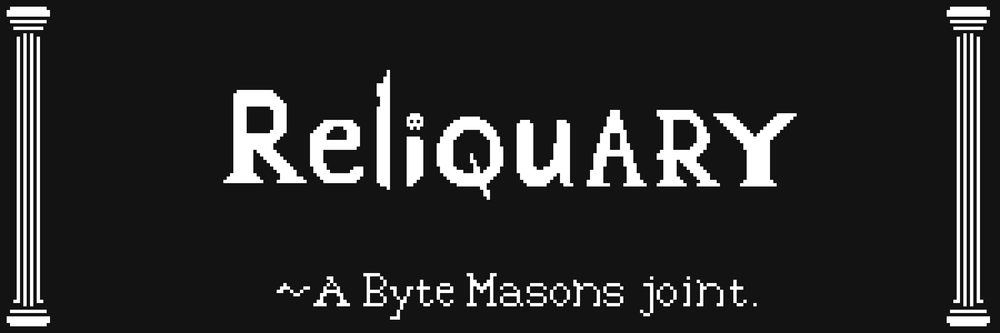

# Reliquary



> Designed and written by [Justin Bebis](https://twitter.com/0xBebis_) and Zokunei, with help from [Goober](https://twitter.com/0xGoober) and the rest of the [Byte Masons](https://twitter.com/ByteMasons) crew.
---
Reliquary is a smart contract system that is designed to improve outcomes of incentive distribution by giving users and developers fine grained control over their investments and rewards. It accomplishes this with the following features:
1) Emits tokens based on the maturity of a user's investment, separated in tranches.
2) Binds variable emission rates to a base emission curve designed by the developer for predictable emissions.
3) Supports deposits and withdrawals along with these variable rates, which has historically been impossible.
4) Issues a 'financial NFT' to users which represents their underlying positions, able to be traded and leveraged without removing the underlying liquidity.
5) Can emit multiple types of rewards for each investment as well as handle complex reward mechanisms based on deposit and withdrawal.

By binding tokens to a base emission rate you not only gain the advantage of a predictable emission curve, but you're able
to get extremely creative with the Curve contracts you write. Whether this be a sigmoid curve, a square root curve, or a
random curve, you can codify the user behaviors you'd like to promote.

Please reach out to zokunei@bytemasons.com to report bugs or other funky behavior. We will proceed with various stages of production
testing in the coming weeks.


## Installation
This is a Foundry project. Get Foundry from [here](https://github.com/foundry-rs/foundry).

Please run the following command in this project's root directory to enable pre-commit testing:

```bash
ln -s ../../pre-commit .git/hooks/pre-commit
```

## TODO
- NFT Desccriptor needs to be ajusted
- Deployment script needs to be ajusted